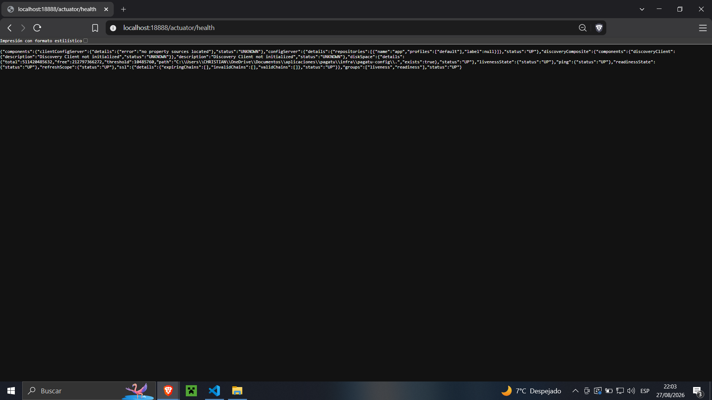
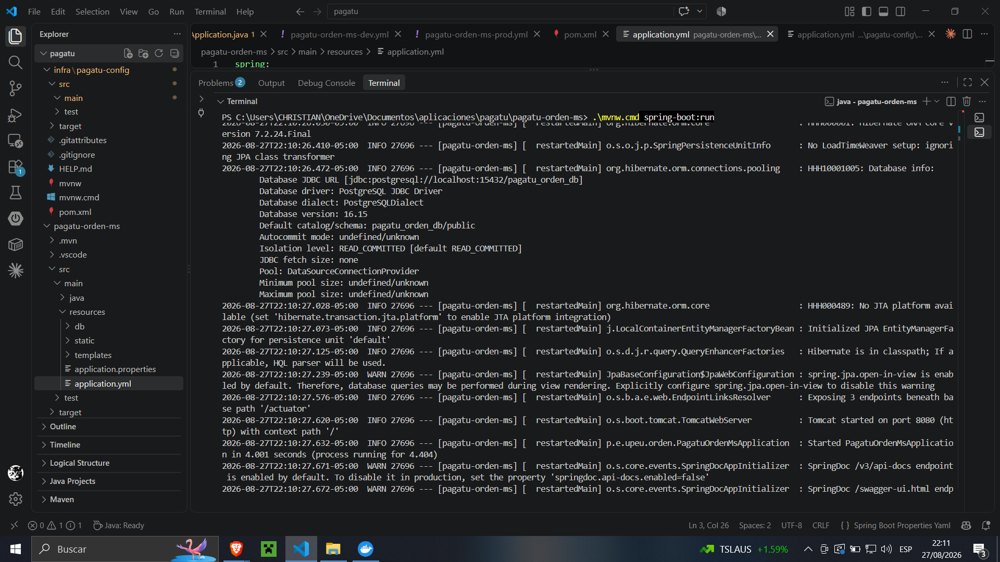
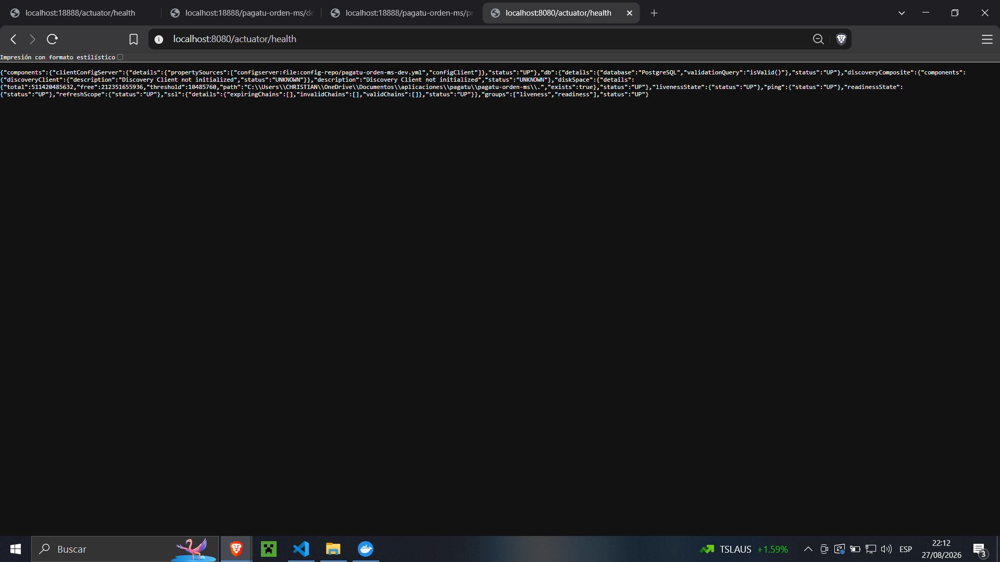

# S02 - Gestión Centralizada de Configuración y Ambientes
## Evidencia individual — pagatu-orden-ms

### Datos del estudiante
* **Nombre:** Christian Yoel Soncco Vargas
* **Equipo:** [sin equipo]
* **Sesión:** S02 - Gestión Centralizada de Configuración y Ambientes
* **Rol o aporte realizado:** Configuración del servidor `pagatu-config` y migración de `pagatu-orden-ms` a Config Client.
* **Link de GitHub:** [https://github.com/christianyoel]

### 1. pagatu-config operativo
El servidor de configuración centralizada se levantó correctamente en el puerto 18888, leyendo los archivos desde el repositorio local `config-repo`.

*Descripción: La respuesta de `/actuator/health` en localhost:18888 muestra el estado UP, confirmando que el Config Server está operativo.*

### 2. Configuración externa del microservicio replicado
Se crearon los archivos `pagatu-orden-ms-dev.yml` y `pagatu-orden-ms-prod.yml` dentro de la carpeta `config-repo`.

*Descripción: Consulta HTTP a `http://localhost:18888/pagatu-orden-ms/dev`. La respuesta JSON muestra las variables de configuración inyectadas correctamente para el entorno de desarrollo, incluyendo la conexión a PostgreSQL local en el puerto 15432.*

*Descripción: Consulta HTTP a `http://localhost:18888/pagatu-orden-ms/prod`. Se evidencia la separación de ambientes, mostrando variables preparadas para Docker (como `${DB_HOST}`) y la desactivación de Swagger para el entorno de producción.*

### 3. Microservicio replicado como Config Client funcional
El microservicio `pagatu-orden-ms` eliminó sus archivos locales y ahora se conecta a `pagatu-config` para obtener sus propiedades al arrancar.

*Descripción: Los logs de la terminal muestran a `pagatu-orden-ms` obteniendo su configuración remota y arrancando con éxito en el puerto 8080.*

*Descripción: Consulta a `/actuator/health` del microservicio en el puerto 8080. El estado UP y la conexión a la base de datos demuestran que el servicio funciona perfectamente con la configuración externa.*

### 4. Comparación DEV/PROD y comprensión
* **Comparación:** Al comparar `pagatu-orden-ms-dev.yml` y `pagatu-orden-ms-prod.yml`, un valor claramente distinto es la URL de la base de datos. En DEV estaba "hardcodeado" como `jdbc:postgresql://localhost:15432/pagatu_orden_db`, mientras que en PROD se parametriza como `jdbc:postgresql://${DB_HOST}:${DB_PORT}/${DB_NAME}`. Además, Swagger está explícitamente apagado en producción (`springdoc.swagger-ui.enabled: false`).
* **¿Cómo separa Config Server el código y la configuración?** Extrae los archivos `.yml` del código fuente compilado (.jar) y los aloja en un servidor independiente. Esto permite que el microservicio actúe como un cliente ciego que, al iniciar, hace una petición HTTP para descargar sus variables. Así, se pueden cambiar credenciales o puertos sin necesidad de recompilar la aplicación.

### 5. Error o hallazgo
* **Qué ocurrió:** Al intentar levantar el Config Server, no encontraba la ruta del repositorio.
* **Cómo lo diagnostiqué:** Revisé el archivo `application.yml` de `pagatu-config`. 
* **Cómo lo corregí:** Me aseguré de estar parado con la consola exactamente en la carpeta `infra/pagatu-config` antes de correr el comando `mvnw spring-boot:run`, para que la ruta relativa `file:./config-repo` apuntara al lugar correcto. También corregí un espacio accidental en el nombre de aplicación de mi cliente (`pagatu orden ms` a `pagatu-orden-ms`).

### 6. Reflexión técnica breve
**¿Cómo ayuda Config Server cuando el sistema crece a muchos microservicios e instancias?**
Cuando la plataforma crece, administrar manualmente los `.yml` dentro de decenas de microservicios se vuelve inmanejable. Si hay que cambiar una contraseña de base de datos o un timeout, con Config Server se actualiza en un solo repositorio central. Los servicios simplemente reinician y descargan el nuevo valor, eliminando el riesgo de discrepancias entre ambientes o la necesidad de generar nuevos builds de código por un simple ajuste de texto.