# S03 - Registro, Descubrimiento y Ejecución Concurrente de Servicios

## Evidencia individual — pagatu-orden-ms

### Datos del estudiante

* **Nombre:** Christian Yoel Soncco Vargas
* **Equipo:** sin equipo
* **Sesión:** S03 - Registro, Descubrimiento y Ejecución Concurrente de Servicios
* **Rol o aporte realizado:** Construcción de `pagatu-eureka` como servidor de registro y conexión de `pagatu-orden-ms` como cliente Eureka, con dos instancias simultáneas verificadas en el dashboard.
* **Link de GitHub:** https://github.com/christianyoel

---

## 1. pagatu-eureka operativo

Se construyó `pagatu-eureka` dentro de `infra/pagatu-eureka` con las dependencias `spring-cloud-starter-netflix-eureka-server`, `spring-cloud-starter-config` y `spring-boot-starter-actuator`. La clase principal se anotó con `@EnableEurekaServer` para activar el servidor de registro. Su `application.yml` es mínimo y sigue el mismo patrón de S02: solo declara el nombre y delega toda la configuración a `pagatu-config`.

La configuración completa de DEV vive en `config-repo/pagatu-eureka-dev.yml` con `enable-self-preservation: false` (solo en DEV, para evitar alertas con pocas instancias) y `register-with-eureka: false` (el propio servidor no debe registrarse como cliente).

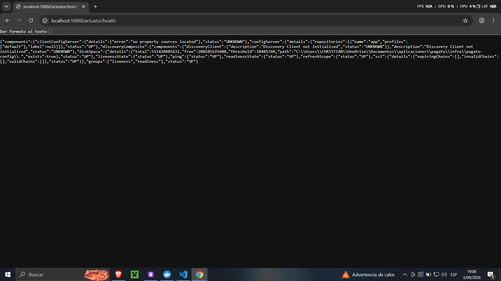
*Descripción: `localhost:18888/actuator/health` muestra estado UP, confirmando que el Config Server está operativo y que `pagatu-eureka` puede cargar su configuración al arrancar.*

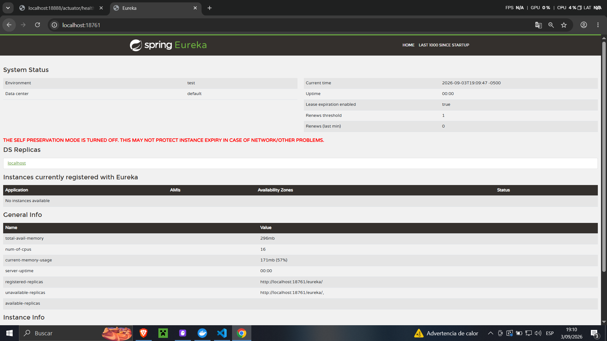
*Descripción: Dashboard de `pagatu-eureka` en `localhost:18761` recién arrancado, sin instancias registradas. El banner "THE SELF PRESERVATION MODE IS TURNED OFF" confirma que la configuración de DEV se aplicó correctamente.*

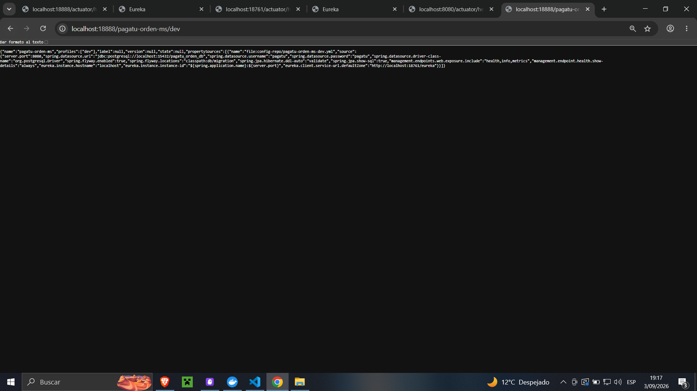
*Descripción: `localhost:18761/actuator/health` devuelve UP con `configServer` y `discoveryComposite` activos, confirmando que el servidor de registro está operativo y conectado a `pagatu-config`.*

---

## 2. pagatu-orden-ms migrado a Config Client y conectado a Eureka

`pagatu-orden-ms` ya tenía Config Client desde S02. En esta sesión se agregó `spring-cloud-starter-netflix-eureka-client` al `pom.xml` y el bloque `eureka:` en `config-repo/pagatu-orden-ms-dev.yml` como sección raíz independiente, al mismo nivel que `server:` y `management:`:

```yaml
eureka:
  instance:
    hostname: localhost
    instance-id: ${spring.application.name}:${server.port}
  client:
    service-url:
      defaultZone: http://localhost:18761/eureka
```

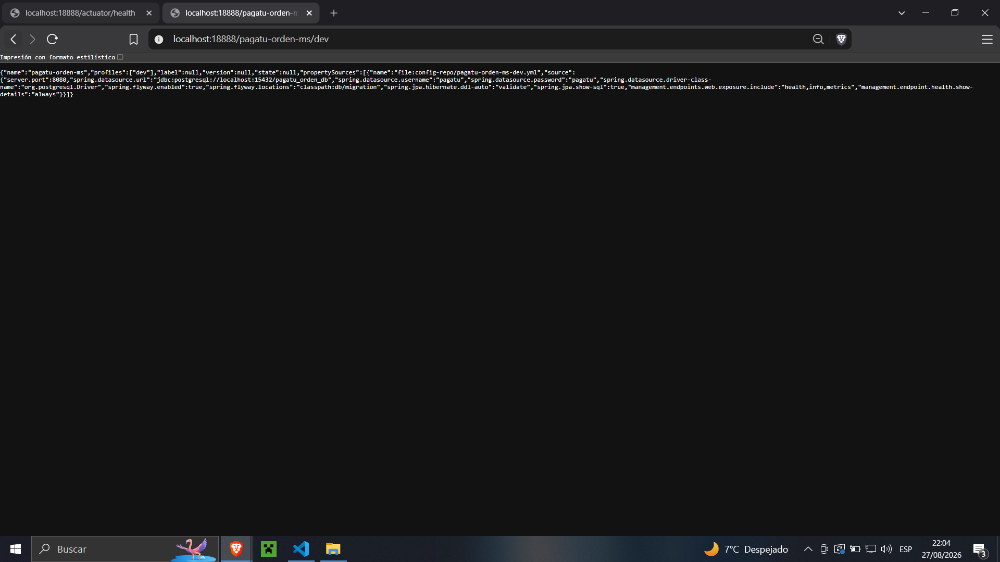
*Descripción: `localhost:18888/pagatu-orden-ms/dev` devuelve el JSON con todas las propiedades de `pagatu-orden-ms-dev.yml`, incluyendo la sección `eureka` con `instance-id` y `defaultZone`. Confirma que `pagatu-config` entrega correctamente la configuración de Eureka Client.*

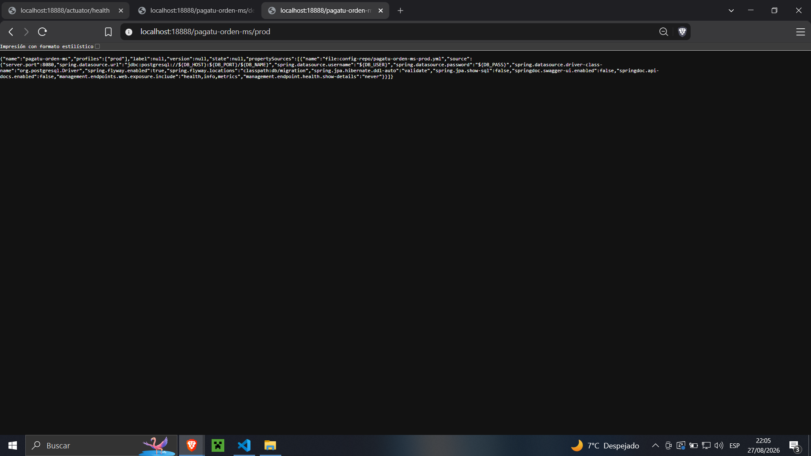
*Descripción: `localhost:18888/pagatu-orden-ms/prod` muestra las propiedades del ambiente de producción, evidenciando la separación real entre ambientes.*

---

## 3. pagatu-orden-ms registrado con múltiples instancias

Se levantó primero el contenedor de PostgreSQL y luego la primera instancia del microservicio con `.\mvnw.cmd spring-boot:run`. Para la segunda instancia, sin cerrar la primera, se pasó un puerto distinto por línea de comandos igual que en S01.

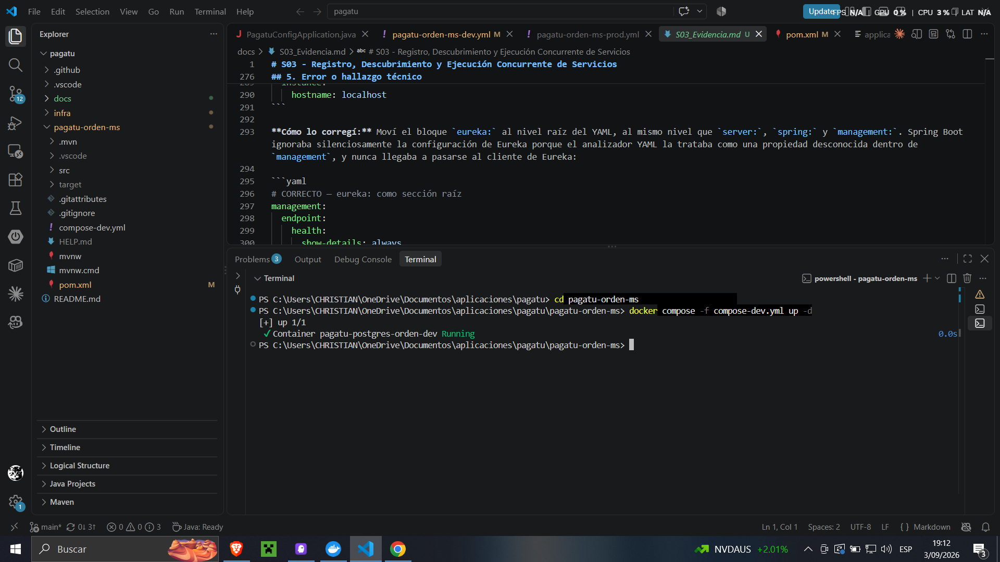
*Descripción: El contenedor `pagatu-postgres-orden-dev` está en estado Running, habilitando la conexión de `pagatu-orden-ms` a la base de datos.*

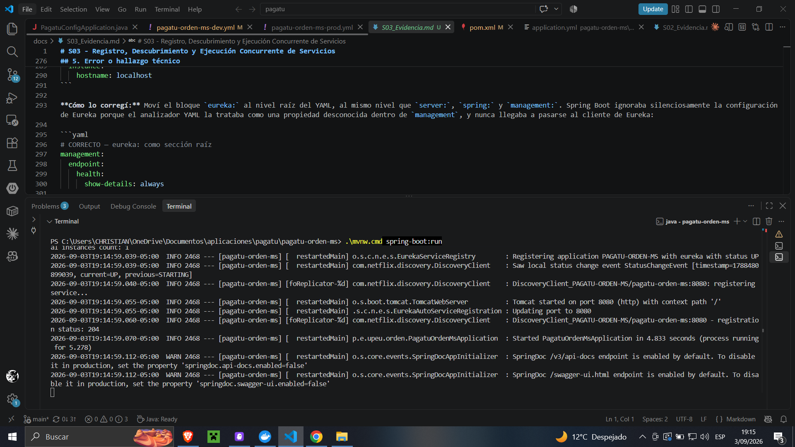
*Descripción: La terminal muestra `Registering application PAGATU-ORDEN-MS with eureka with status UP`, `registration status: 204` y `Tomcat started on port 8080`. La instancia 1 se registró exitosamente en Eureka.*

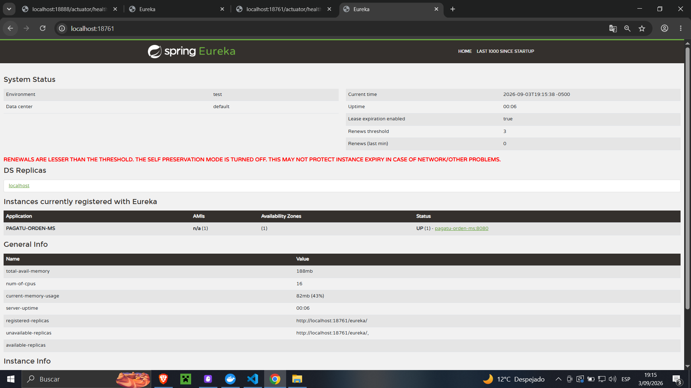
*Descripción: Dashboard de Eureka mostrando PAGATU-ORDEN-MS con `UP (1) - pagatu-orden-ms:8080`. La instancia se anunció sola al arrancar.*

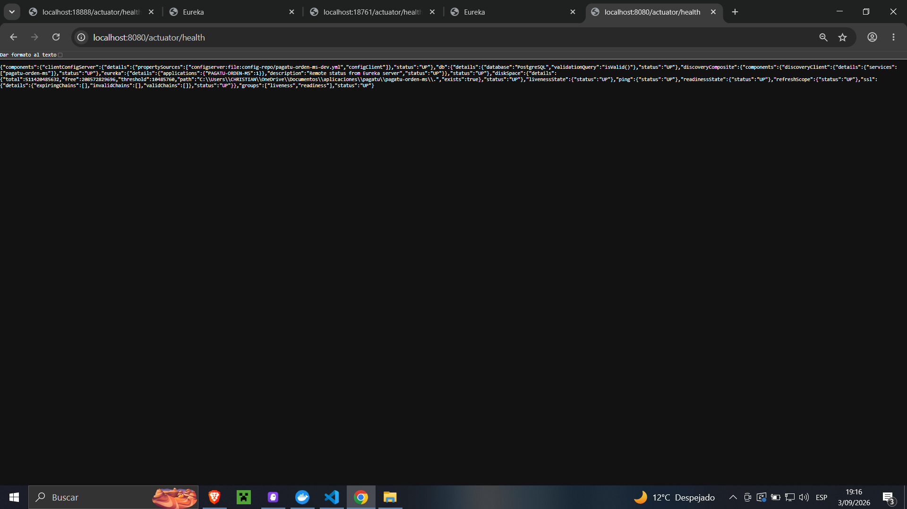
*Descripción: `localhost:8080/actuator/health` devuelve UP con `db`, `eureka` y `configServer` activos. La instancia 1 funciona correctamente con la configuración externa.*

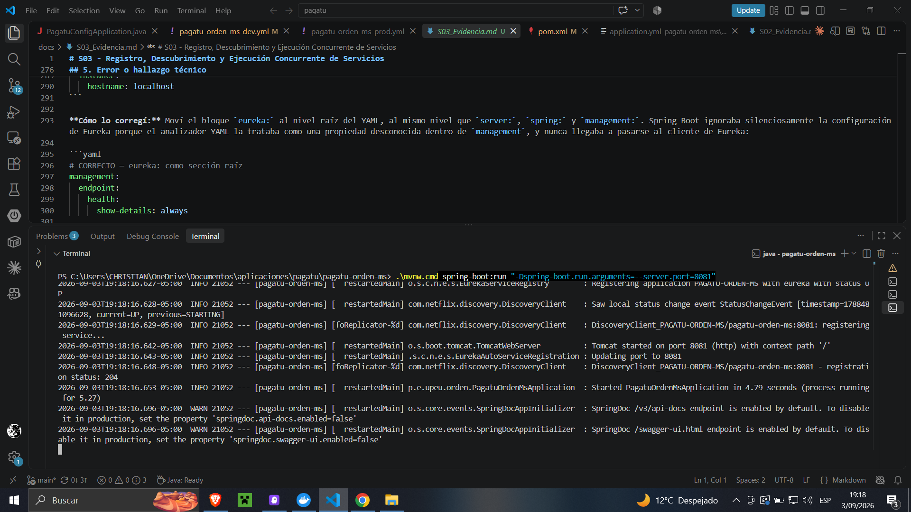
*Descripción: La segunda terminal muestra `registration status: 204` y `Tomcat started on port 8081`. La instancia 2 se registró en Eureka bajo el mismo nombre lógico con puerto distinto.*

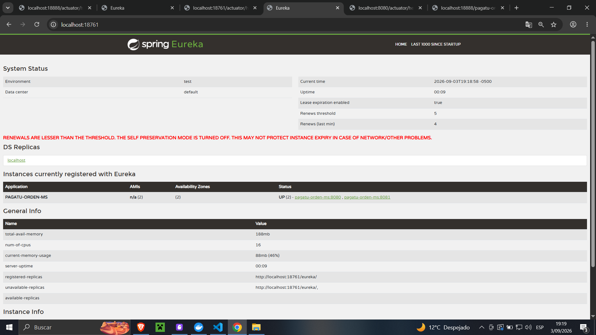
*Descripción: Dashboard de Eureka mostrando PAGATU-ORDEN-MS con `UP (2) - pagatu-orden-ms:8080, pagatu-orden-ms:8081`. El mismo nombre lógico, dos instancias con puertos fijos distintos, cada una registrada de forma independiente sin intervención manual.*

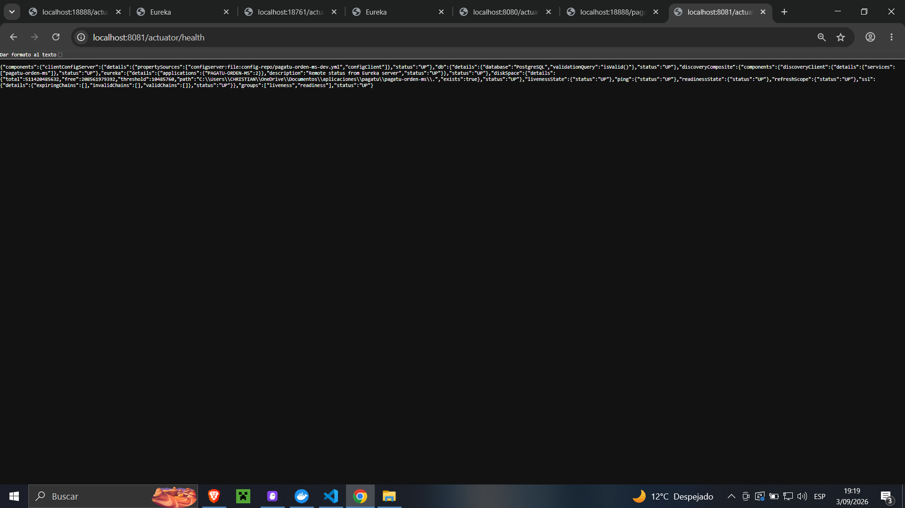
*Descripción: `localhost:8081/actuator/health` devuelve UP confirmando que la segunda instancia funciona de forma independiente.*

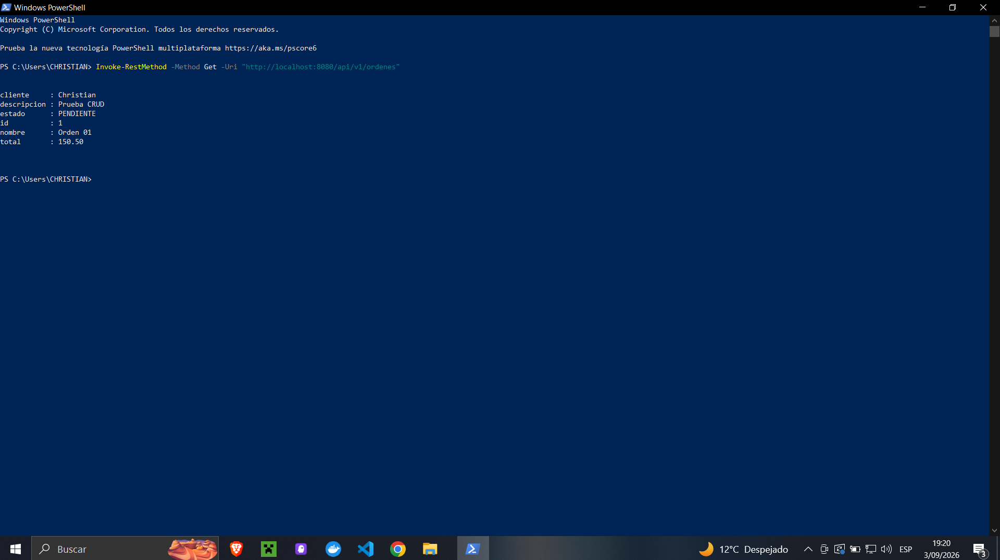
*Descripción: `Invoke-RestMethod` contra `localhost:8080/api/v1/ordenes` devuelve la lista de órdenes. La instancia 1 responde correctamente.*

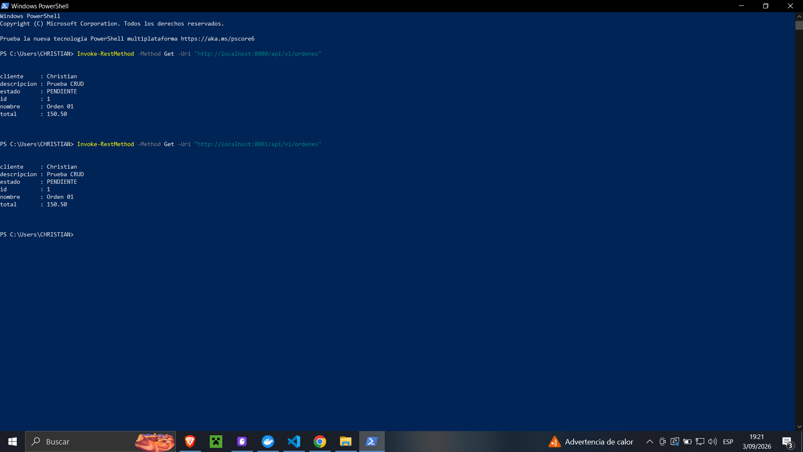
*Descripción: El mismo endpoint contra `localhost:8081/api/v1/ordenes` devuelve los mismos datos. Ambas instancias sirven tráfico de forma independiente desde la misma base de datos.*

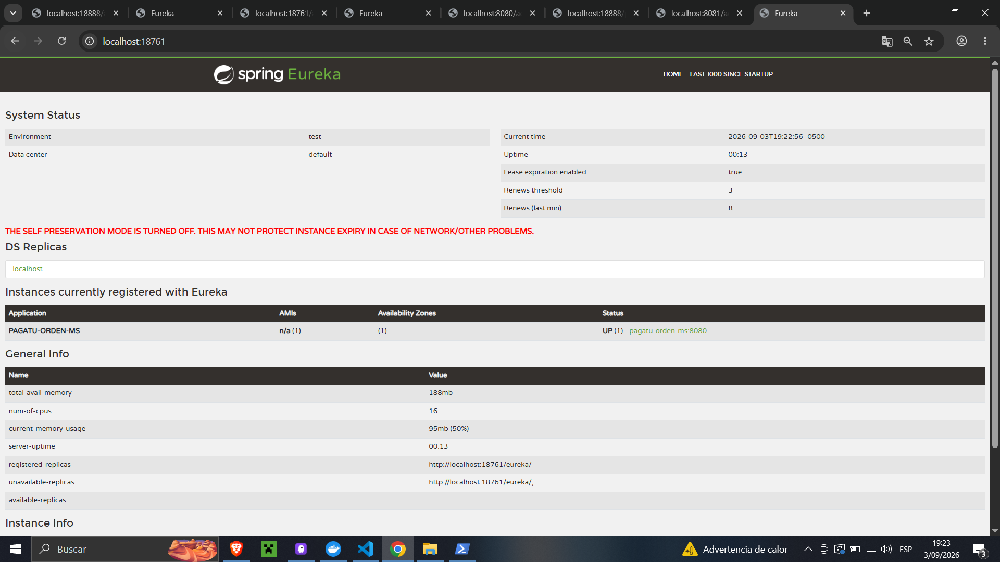
*Descripción: Tras detener la instancia 8081 con Ctrl+C, el dashboard de Eureka actualiza automáticamente sin intervención manual. La instancia desaparece del registro cuando expira su último heartbeat.*

---

## 4. Comprensión del patrón

Con dos instancias del mismo servicio en puertos distintos, cualquier cliente que quiera repartir tráfico entre ellas tiene que conocer ambas direcciones de antemano. Con varios microservicios y varias instancias cada uno, mantener esa lista manualmente se vuelve inmanejable.

El patrón Service Registry resuelve esto invirtiendo la responsabilidad: cada instancia se registra sola al arrancar con su nombre lógico y su dirección real. Quien necesite comunicarse pregunta al registro por el nombre, no por una dirección fija. Si una instancia cae, Eureka deja de anunciarla cuando expira su heartbeat, sin que nadie tenga que notificarlo.

En este proyecto, `pagatu-orden-ms` aparece como `PAGATU-ORDEN-MS` en el dashboard sin importar cuántas instancias estén corriendo ni en qué puertos. Los puertos `8080` y `8081` los conoce Eureka, no los clientes. Con el Gateway de S04 esto va un paso más allá: el cliente externo ni siquiera sabe que Eureka existe, llama siempre al mismo punto de entrada y el Gateway resuelve qué instancia atiende cada petición.

---

## 5. Error o hallazgo técnico

* **Qué ocurrió:** `pagatu-orden-ms` arrancaba en el puerto correcto pero no aparecía en el dashboard de Eureka.
* **Cómo lo diagnostiqué:** Revisé `config-repo/pagatu-orden-ms-dev.yml` y encontré que el bloque `eureka:` estaba indentado dentro de `management.endpoint.health` en lugar de ser una sección raíz. Spring Boot lo ignoraba silenciosamente como propiedad desconocida.
* **Cómo lo corregí:** Moví `eureka:` al nivel raíz del YAML, al mismo nivel que `server:`, `spring:` y `management:`. Tras reiniciar `pagatu-config`, `pagatu-orden-ms` se registró correctamente en el siguiente arranque.

---

## 6. Reflexión técnica breve

**¿Por qué el registro y descubrimiento de servicios es un prerrequisito para el Gateway y el balanceo de carga de S04?**

El Gateway usa la dirección lógica `lb://pagatu-orden-ms` para enrutar peticiones y es Eureka quien resuelve esa dirección a las instancias reales disponibles en ese momento. Sin un registro operativo con los servicios registrados, el Gateway no tiene forma de saber a dónde enviar el tráfico. El registro es la fuente de verdad del sistema sobre qué instancias existen y están vivas; el Gateway es su consumidor más visible.

---

## Anexo — Feedback de la sesión

1. El aprendizaje más importante es que cada instancia se registra sola y el cliente solo necesita el nombre lógico, no la dirección.
2. Lo más confuso fue entender por qué quien prueba a mano sigue necesitando el puerto exacto hoy, y cómo eso cambia con el Gateway en S04.
3. Para la siguiente clase: ¿el Gateway puede enrutar a servicios que no están en Eureka, o todo el tráfico tiene que pasar por el registro?
4. Nivel de comprensión: Entendido, podría explicarlo.
5. Para comprender mejor: un diagrama de secuencia del flujo completo desde una petición externa hasta la instancia que la atiende, pasando por el Gateway y Eureka.
6. Autoevaluación: Muy comprometido, me esforcé al máximo.
7. Satisfacción con la clase: 10.
