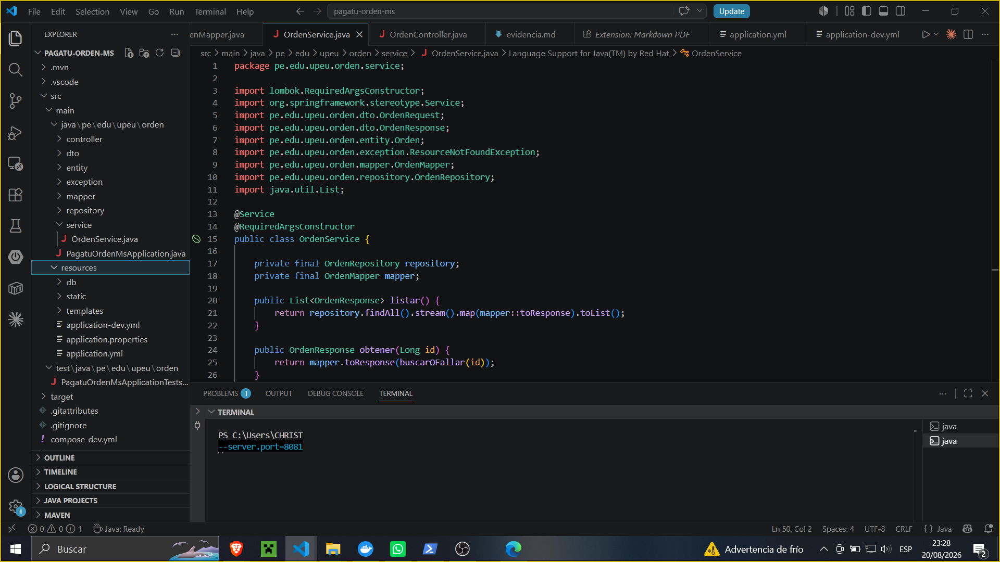
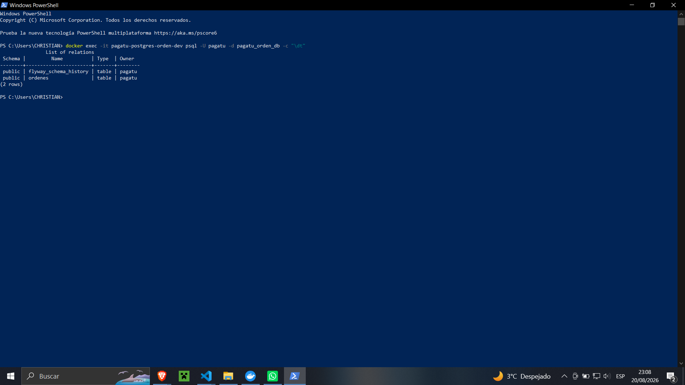
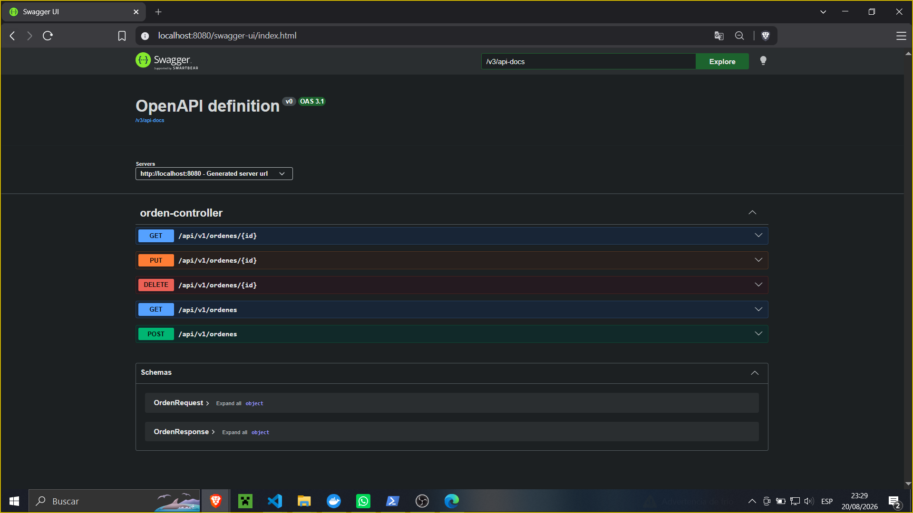
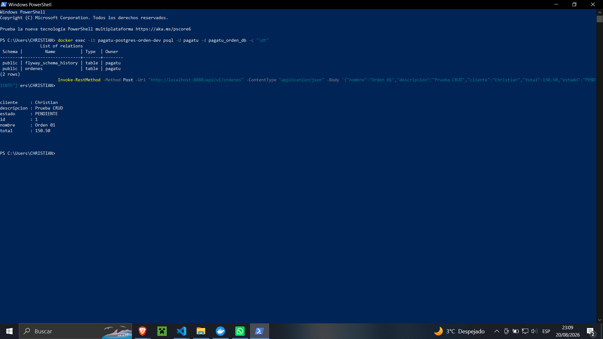
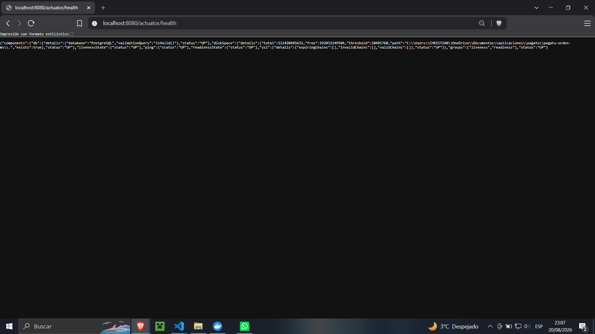
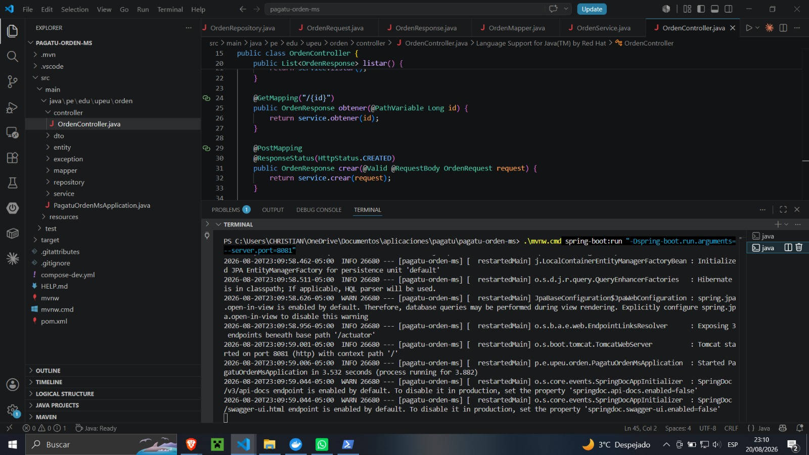

# S01 - Construcción de un servicio base para un sistema distribuido
## Evidencia individual — pagatu-orden-ms

### Datos del estudiante

| Campo | Información |
| :--- | :--- |
| **Nombre** | Christian Yoel Soncco Vargas |
| **Equipo** | sin equipo |
| **Sesión** | S01 - Construcción de un servicio base para un sistema distribuido |
| **Rol o aporte realizado** | Replicación autónoma del patrón de `pagatu-catalogo-ms` en otro microservicio del dominio, `orden-ms`. |
| **Link de GitHub** | https://github.com/christianyoel |

### 1. Resumen de la actividad
Se construyó y verificó `pagatu-orden-ms` como microservicio independiente del dominio de órdenes. La evidencia cubre persistencia con PostgreSQL y Flyway, ejecución con Maven Wrapper, API REST, Swagger, Actuator, pruebas CRUD y ejecución de dos instancias en paralelo en entorno DEV.

### 2. Evidencia técnica
Cada captura se acompaña de una descripción específica que explica qué se observa y por qué esa evidencia respalda el criterio de la rúbrica.

#### Bloque 1 — Microservicios correctamente delimitados según el dominio
`orden-ms` gestiona las entidades propias del dominio de órdenes, principalmente la entidad `Orden`. Estas responsabilidades corresponden al ciclo de una orden, mientras que `pagatu-catalogo-ms` mantiene categorías y productos.

*Descripción. El Explorador de VS Code muestra el proyecto pagatu-orden-ms y sus elementos principales. Esta captura evidencia que el trabajo autónomo se realizó sobre un microservicio independiente.*

#### Bloque 2 — Persistencia de datos con PostgreSQL y Flyway
La persistencia del microservicio se respalda con PostgreSQL y Flyway. 

*Descripción. La consola muestra la ejecución del comando \dt mediante psql dentro del contenedor. Se devuelven las tablas flyway_schema_history y ordenes, evidenciando que las tablas existen.*

#### Bloque 3 — Endpoints REST funcionales y documentados
La API del dominio expone operaciones para órdenes. 

*Descripción. La interfaz de Swagger muestra la definición OpenAPI del servicio y el orden-controller con sus operaciones GET, POST, PUT y DELETE.*

*Descripción. PowerShell ejecuta un POST sobre /api/v1/ordenes enviando un JSON. La respuesta devuelve la orden creada, demostrando la operación de alta.*

#### Bloque 4 — Ejecución y escalamiento horizontal
La ejecución DEV se valida mediante Actuator y mediante dos procesos del mismo servicio.

*Descripción. El navegador consulta /actuator/health y devuelve el estado general UP. Esto demuestra que el servicio está operativo y conectado a la base de datos.*

*Descripción. PowerShell muestra la ejecución de una segunda instancia del microservicio. La consola confirma "Tomcat started on port 8081", evidenciando el escalamiento horizontal.*

### 3. Reproducción técnica
1. Levantar PostgreSQL DEV mediante `docker compose -f compose-dev.yml up -d`.
2. Ejecutar el microservicio con Maven Wrapper: `.\mvnw.cmd spring-boot:run`.
3. Verificar tablas en PostgreSQL con comandos `psql`.
4. Verificar `/actuator/health`.
5. Probar CRUD por PowerShell y levantar segunda instancia con `--server.port=8081`.

### 4. Error o hallazgo técnico
* **Qué ocurrió:** Al levantar la segunda instancia, falló indicando `Port 8080 was already in use`.
* **Cómo lo diagnosticó:** Revisando los logs de la terminal, Spring Boot indicó el conflicto de puertos.
* **Cómo lo corrigió:** Volví a ejecutar el comando añadiendo el parámetro `--server.port=8081`.

### 5. Reflexión técnica
Un microservicio debe poder ejecutarse de forma reproducible en DEV y PROD para conservar el mismo comportamiento esencial. El escalamiento horizontal permite agregar instancias sin cambiar la lógica; por eso un microservicio no debe depender de un puerto fijo. La distribución del tráfico debe ser responsabilidad de la infraestructura (Gateway).

### 6. Preguntas de defensa

| Pregunta | Respuesta |
| :--- | :--- |
| **¿Por qué la 2da instancia usa 8081?** | Para evitar el conflicto de puerto con la instancia que ya usa 8080. |
| **¿Qué demuestra que PostgreSQL fue usado?** | Las consultas psql, la existencia de tablas y el estado db: UP de Actuator. |
| **¿Qué aporta Flyway?** | Versiona y aplica la estructura de la base mediante migraciones. |

### 7. Anexo — Feedback de la sesión
1. **¿Cuál es el aprendizaje más importante?** Aprender a replicar el patrón de un microservicio completo.
2. **¿Qué resultó más confuso?** La asignación de puertos.
3. **¿Tienes alguna pregunta?** ¿Cómo se incorpora el Gateway para distribuir peticiones?
4. **Nivel de comprensión:** ¡Entendido! - Lo domino y podría explicarlo.
5. **Autoevaluación:** Muy Comprometido/a.
6. **Satisfacción:** 10